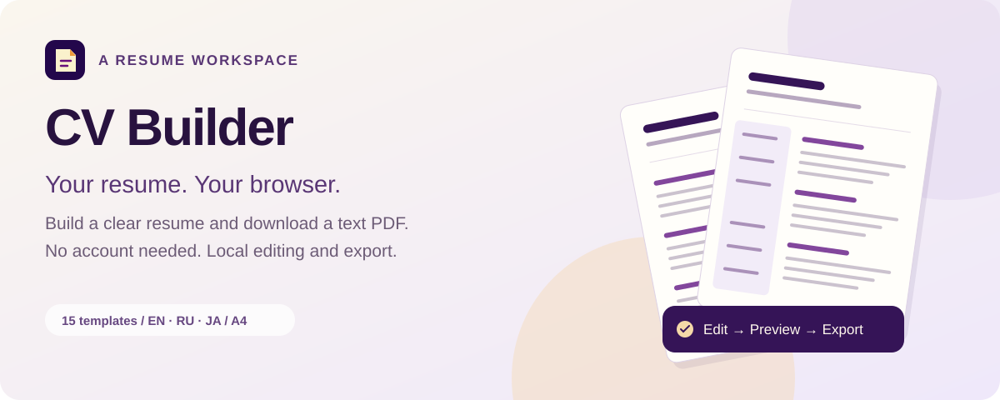
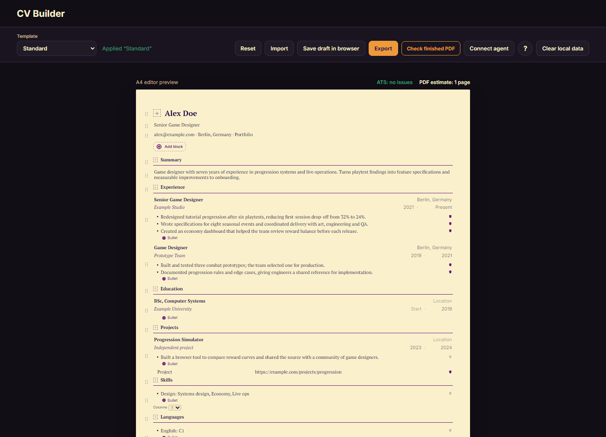

<p align="center">
  
</p>

<h1 align="center">CV Builder</h1>

<p align="center">Create, edit and export your resume. Your local draft stays in your browser.</p>

<p align="center">
  <a href="https://flodirka.github.io/cv-builder-web/"></a>
  <a href="https://github.com/Flodirka/cv-builder-plugin#install"></a>
  <a href="#support-the-project"></a>
</p>

<p align="center"><a href="#get-started">Get started</a> · <a href="#features">Features</a> · <a href="#connect-an-agent">Connect an agent</a> · <a href="#privacy-model">Privacy</a></p>

## Get started

1. [Open CV Builder](https://flodirka.github.io/cv-builder-web/).
2. Choose a template or start with Custom, then replace the example facts with your own.
3. Edit your blocks, check the preview, and choose **Export → Download PDF**.



_The published editor with a fictional sample resume. Editing and PDF export run in your browser._

## Features

| Build your document                                                    | Keep control of your data                           |
| ---------------------------------------------------------------------- | --------------------------------------------------- |
| Fifteen templates, including two-column layouts and a Japanese example | Editing, local drafts and PDF export in the browser |
| English, Russian and Japanese text with bundled fonts                  | No account, analytics or advertising                |
| Editable columns, tables, photos and heading icons                     | Markdown and JSON import/export                     |
| A4 text/vector PDF with a preview of every page                        | Local ATS preflight and finished-PDF inspection     |

## About the editor

CV Builder Web is a public, local-first resume editor with an optional Connected Builder handoff
for MCP agents. Open the published editor: [CV Builder Web](https://flodirka.github.io/cv-builder-web/).

The [CV Builder plugin](https://github.com/Flodirka/cv-builder-plugin) packages four resume
workflows (draft, tailor, review, and rewrite) with the same MCP server. Its README covers
installation and agent use.

Normal editing happens in the browser. When a user connects an agent, the relay holds the agent's
Markdown only long enough to deliver it to one Builder tab.

Version 0.2.0 adds fifteen editable content templates with full-width and nested-column blocks,
profile photos, alignment, and two-column lists. Download their Markdown files from the Import
dialog. The same blocks drive the A4 preview and text/vector PDF export.

Choose a heading icon beside the heading. Category tabs and search cover the complete local Lucide collection (1664 icons). Markdown
stores an icon name such as `icon=lucide:briefcase`; no icon service or external image request is
required. The collection is sourced from [Aria Icons](https://github.com/LeulAria/Aria-Icons) at
revision `bd0a75207641c67da152d42e7b03246423d8e75e`. Attribution and full license notices are in
[LUCIDE-LICENSE.md](packages/pdf-templates/LUCIDE-LICENSE.md).

Upload PNG/JPEG photos up to 200 KiB. They are embedded in Markdown/JSON and remain available
offline. Remote photo URLs imported from older documents are blocked by the static site's image
policy; replace them with an upload. Template samples are fictional. English and Russian documents
use PT Serif; Japanese documents use bundled Zen Kaku Gothic New. All templates use the same PDF
pipeline. Japan is an editable two-page A4 rirekisho example following MHLW sections, not an official
government form. Use the employer's form when required. Full Chinese and Korean font coverage is
not included. Minimal replaces the redundant USA example; country guidance remains in Help.

Choose Add block → Table to edit rows and cells, or Page break to start a new page between main
blocks. Tables support two to six columns, relative widths, an optional header row and alignment.
Writing tips are available in Help and block actions. All example facts must be replaced before
submitting a resume.

## Build your own layout

Custom starts empty. Choose **Add block → Columns**, then open the drag handle's Block actions to
select two or three columns. A pair can have equal widths or a narrow left/right column; three
columns are equal. Every column accepts any block, including another Columns block. Drag blocks
between columns or use the move actions. A nonempty third column prevents reducing the count.
Text alignment and heading level, underline, uppercase, and bold controls are in Block actions.

Column structure and widths survive Markdown import/export:

```markdown
::: columns{zone=main}

::: column width=1

## Skills{zone=main}

Your skills{zone=main}
::: endcolumn

::: column width=2

## Experience{zone=main}

Your experience{zone=main}
::: endcolumn

::: endcolumns
```

Europe provides editable Europass-style sections; Australia includes relevant licences. Use
Minimal or Standard for a general USA resume. These examples do not certify national-format
compliance or provide official Europass import. All templates use white A4. Letter and decorative
page backgrounds are not supported; Japanese fonts are bundled, while complete Chinese and Korean
font coverage is not included.

## Privacy model

- Editing, draft storage, local import/export, PDF generation, and finished-PDF inspection run in
  the browser.
- The editor has no accounts, analytics, advertising, upload API, database, or server-side PDF
  processing.
- `Save draft in browser` saves one draft in this site's browser storage. `Clear local data` removes
  it.
- The service worker caches only application files for offline use. It does not cache resume data.
- The optional Connected Builder relay receives only agent-supplied Markdown, holds it for at most
  five minutes, and deletes it after the user acknowledges the import. It never receives a local
  draft, ATS result, finished PDF, or PDF-inspection data.

See [PRIVACY.md](PRIVACY.md) for the complete data flow and browser-storage behavior.

## Development

Node.js 22 and npm are supported.

```bash
npm ci
npm run dev
```

## Verification

```bash
npm run security:self-test
npm run verify
npx playwright install chromium
npm run qa:static
npm audit --omit=dev --audit-level=high
```

`npm run security:check` writes a machine-readable report to
`.security-reports/public-security-scan.json`. Findings contain only paths and rule IDs, never
matched values.

## Static deployment

```bash
CV_BUILDER_BASE_PATH=/repository-name npm run build
```

The static site is written to `out/`. GitHub Pages hosts the editor; the optional Cloudflare Worker
below is a separate, short-lived Markdown handoff service.

## Connect an agent

CV Builder works without an account. To draft a resume with an MCP-capable agent, open the published
Builder, select **Connect agent**, and give the agent the displayed setup prompt. The MCP endpoint
is:

```text
https://cv-builder-relay.flodirka.workers.dev/mcp
```

The agent reads the `cv-builder/v1` Markdown guidance and calls `open_builder`. It returns a
one-time `#connect` link. Open that link in a browser within five minutes, review the replacement,
and choose **Replace current document** to import it. The link capability is removed from the visible
URL before the first relay request; after acknowledgement, the payload is deleted and reuse returns
`410 Gone`.

The Worker never renders, verifies, stores, or returns a PDF. The Builder is the only editor, ATS
checker, finished-PDF inspector, and PDF renderer. A static MCP Apps opener may be available in some
clients, but the browser link is the only integration path verified across supported clients and
is always returned.

The relay accepts canonical Markdown only. It does not accept raw HTML, JSON documents, files,
fetchable URLs, Notion, n8n, Telegram, accounts, OAuth, or a request to choose PDF presentation.

## Supported browsers and PDF limitations

The current release supports the latest stable desktop versions of Chromium-based browsers and
Firefox. Current Safari is expected to work, but automated PDF QA runs in Chromium. Mobile use is
supported at 390 CSS pixels and wider. Downloading or reopening a PDF may still follow the device
browser's file-handling rules.

PDF output is A4, supports full-width and nested columns, is vector/text, and embeds PT Serif for Latin and Cyrillic. It does not use
the system print driver, screenshots, or canvas. The editor verifies page size, extractable text,
safe links, and entry pagination, but it does not promise acceptance by every ATS vendor or preserve
unsupported fonts, scripts, interactive forms, media, or arbitrary HTML from imported files.

## License and security

The source is available under the [MIT License](LICENSE). Read [SECURITY.md](SECURITY.md) before
reporting a vulnerability, and [CONTRIBUTING.md](CONTRIBUTING.md) before opening a pull request.

## Related projects

- [cv-builder-plugin](https://github.com/Flodirka/cv-builder-plugin) is the installable agent
  companion to this editor. It includes four resume-writing skills and the public MCP server used
  for Connected Builder handoffs.

## Support the project

CV Builder is free and account-free. Voluntary support helps cover hosting and development time.

<p align="center">
  <a href="https://boosty.to/gdview_gdbrain/donate"></a>
  <a href="https://www.patreon.com/15806620/join"></a>
  <a href="https://dalink.to/flodirka"></a>
</p>

See the plugin's [SUPPORT.md](https://github.com/Flodirka/cv-builder-plugin/blob/main/SUPPORT.md)
for details. Support never changes the product: no accounts, no perks, no feature gates.
